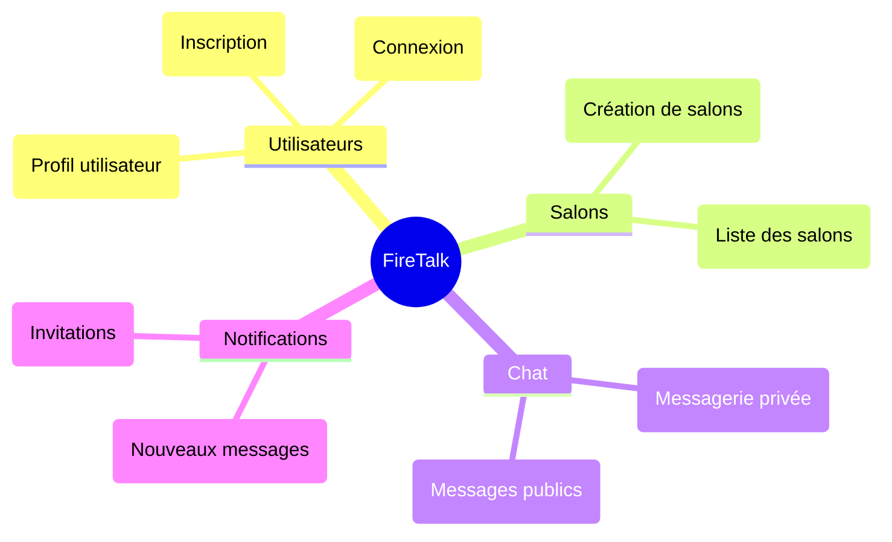
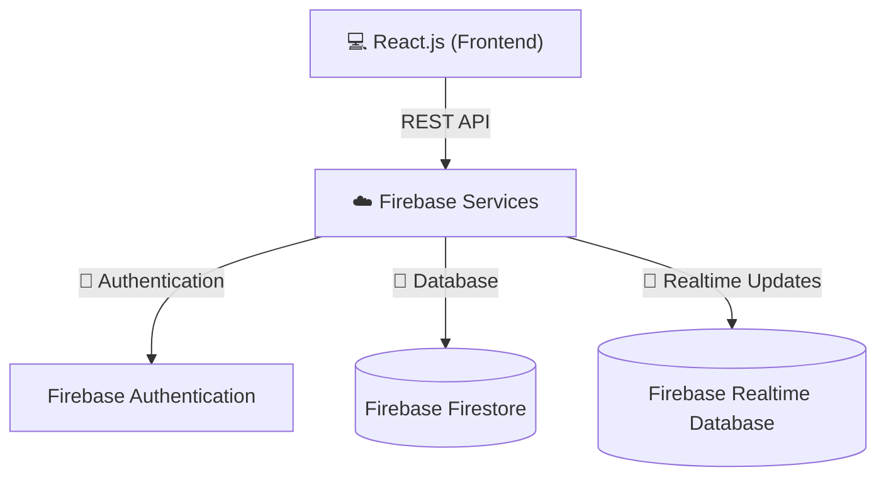

# FireTalk

> **⚠️ Ce projet est actuellement en cours de développement.**  
> Les fonctionnalités décrites dans ce fichier sont prévues et peuvent évoluer.

FireTalk est une application de chat en temps réel, conçue avec **React** et **Firebase** pour offrir une interface fluide et des fonctionnalités modernes comme l’authentification sécurisée, le chat instantané et les notifications. Ce projet est développé dans le cadre du cours **Développement de client riche**.


## 📋 Sommaire

- [🛠️ Fonctionnalités principales](#fonctionnalités-principales)
- [📂 Structure du projet](#structure-du-projet)
- [📐 Architecture](#architecture)
- [🚀 Installation et exécution](#installation-et-exécution)
- [🔄 Workflow Git](#workflow-git)
- [🌐 Technologies utilisées](#technologies-utilisées)
- [📝 Auteurs](#auteurs)
- [🛤️ Roadmap](#roadmap)


## 🛠️ Fonctionnalités principales

### **🔑 Authentification et gestion des utilisateurs**
- Inscription et connexion sécurisées via **Firebase Authentication**.
- Gestion des erreurs d’authentification (ex : utilisateur déjà existant, mot de passe incorrect).
- Personnalisation des profils utilisateurs :
  - Ajout d’une photo de profil et d’un pseudo.
  - Indication du statut en ligne/hors ligne.

### **💬 Salons de discussion**
- Affichage des salons publics disponibles.
- Création et gestion de nouveaux salons.
- Participation à des salons existants.

### **⚡ Chat en temps réel**
- Envoi et réception de messages instantanés grâce à **Firebase Firestore**.
- Mise à jour en temps réel des conversations pour tous les participants.
- Messagerie privée : discussions directes et privées entre utilisateurs.

### **🔔 Notifications**
- Alertes en temps réel pour :
  - Nouveaux messages dans un salon.
  - Invitations à rejoindre un salon ou une discussion privée.


## 📂 Structure du projet

Voici la structure des fichiers du projet, suivie d’un aperçu des modules fonctionnels :

```plaintext
src/
├── components/      # Composants réutilisables (boutons, formulaires, etc.)
├── pages/           # Pages principales (Login, ChatRooms, etc.)
├── styles/          # Fichiers CSS pour le design
├── firebase.js      # Configuration et initialisation de Firebase
├── App.jsx          # Composant principal
└── main.jsx         # Point d'entrée
```

Diagramme des principaux modules et leurs relations :




## 📐 Architecture

L’architecture présentée ici est une proposition initiale et pourrait évoluer au fil du projet. Cette architecture repose sur un frontend développé en React.js, connecté à une backend Firebase pour gérer l’authentification, le stockage des données et les mises à jour en temps réel.




## 🚀 Installation et exécution

### Prérequis

Avant de commencer, assurez-vous que les outils suivants sont installés sur votre machine :

1. [Node.js](https://nodejs.org/) : Inclut npm, le gestionnaire de paquets nécessaire pour installer les dépendances.
2. [Git](https://git-scm.com/) : Utilisé pour cloner le dépôt et gérer le versionnage du code.
3. Navigateur moderne (comme [Chrome](https://www.google.com/chrome/) ou [Firefox](https://www.mozilla.org/firefox/)) : Nécessaire pour tester l'application en local.

### Étapes

Suivez ces instructions pour configurer et exécuter le projet localement :

1. **Cloner le dépôt et installer les dépendances** :  
   ```bash
   git clone https://github.com/maryamabloua/FireTalk.git
   cd FireTalk
   npm install
   ```

3. **Lancer le serveur de développement** :
   ```bash
   npm run dev
   ```

4. **Ouvrir l’application dans le navigateur** : http://localhost:5173/ par défaut.


## 🔄 Workflow Git

Ce workflow est conçu pour structurer le développement et permettre une intégration progressive des fonctionnalités. Il est basé sur deux branches principales et des branches spécifiques aux fonctionnalités.

### Branches principales
- **main** : Contient le code stable, prêt pour la production ou la présentation.
- **develop** : Contient le code en cours de développement. Toutes les nouvelles fonctionnalités sont intégrées ici avant d’être fusionnées dans `main`.

### Branches de fonctionnalités
- Chaque fonctionnalité est développée dans une branche dédiée, créée à partir de `develop`. 
- Nommage des branches : `feature/<nom-de-la-fonctionnalité>`  
  Exemple : `feature/login-page`


## 🌐 Technologies utilisées

- **[React.js](https://reactjs.org/)** : Framework JavaScript pour le frontend.
- **[Firebase](https://firebase.google.com/docs)** :
  - **Authentication** : Gestion des utilisateurs.
  - **Firestore** : Stockage des messages et des salons.
  - **Realtime Database** : Suivi du statut des utilisateurs.
- **[Vite](https://vitejs.dev/)** : Outil de développement rapide pour React.


## 📝 Auteurs

- **Maryam Abloua** ([GitHub](https://github.com/maryamabloua)) : Développeuse.
- **Victor Hüni** ([GitHub](https://github.com/victorhueni)) : Développeur.


## 🛤️ Roadmap

### **Initialisation du projet**
- [x] Initialisation du projet avec React et Vite.
- [x] Configuration de la structure de base du projet :
  - [x] Création des dossiers pour les composants, pages et styles.
  - [x] Ajout des dépendances nécessaires (React Router, etc.).
- [ ] Développement de l'interface utilisateur :
  - [ ] Écran de connexion et d'inscription (statique).
  - [ ] Liste des salons de discussion avec données statiques.

### **Routage et UI avancée**
- [ ] Mise en place du routage avec React Router.
- [ ] Configuration initiale de Firebase dans le projet.
- [ ] Création de la page de discussion :
  - [ ] Interface pour l’envoi et l’affichage de messages (statique).

### **Intégration de Firebase**
- [ ] Configuration complète de Firebase.
- [ ] Implémentation de Firebase Authentication :
  - [ ] Inscription et connexion des utilisateurs.
  - [ ] Gestion des erreurs (ex : utilisateur déjà existant).
- [ ] Conversion des données statiques en données dynamiques :
  - [ ] Liste des salons récupérée depuis Firestore.
  - [ ] Messagerie connectée à Firestore (en temps réel).

### **Fonctionnalités avancées**
- [ ] Gestion des profils utilisateurs :
  - [ ] Ajout d'une photo de profil, pseudo et statut.
- [ ] Notifications de nouveaux messages ou invitations à des salons.
- [ ] Statut en ligne/hors ligne pour les utilisateurs.
- [ ] Messages privés entre utilisateurs.

### **Finalisation et présentation**
- [ ] Tests des principales fonctionnalités.
- [ ] Corrections des bugs identifiés.
- [ ] Démonstration finale.

---