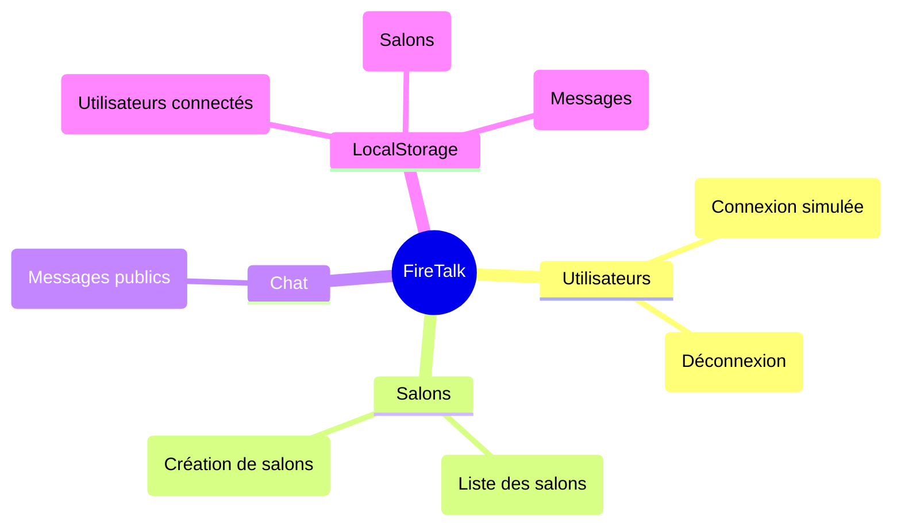
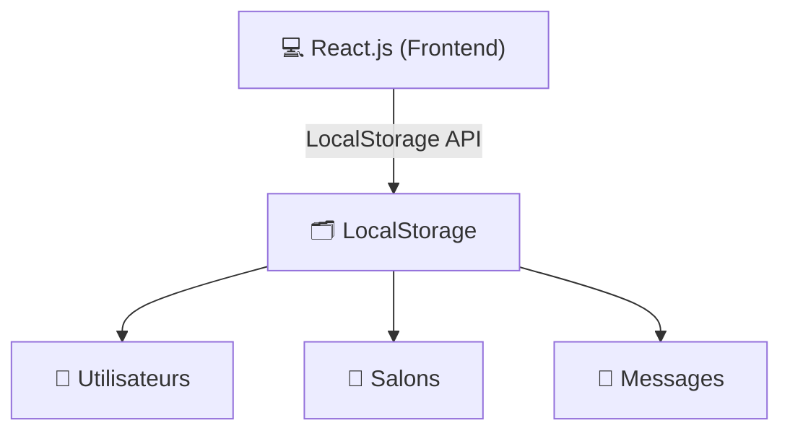

# FireTalk

> **⚠️ Ce projet est actuellement en cours de développement.**  
> Les fonctionnalités décrites dans ce fichier sont prévues et peuvent évoluer.

FireTalk est une **application de chat en temps réel**, conçue avec React, utilisant actuellement LocalStorage pour gérer les utilisateurs, salons et messages. Firebase pourra être intégré à l’avenir pour offrir des fonctionnalités avancées comme l’authentification sécurisée et le chat en temps réel. Ce projet est développé dans le cadre du cours **Développement de client riche**.


## 📋 Sommaire

- [🛠️ Fonctionnalités principales](#fonctionnalités-principales)
- [📂 Structure du projet](#structure-du-projet)
- [📐 Architecture](#architecture)
- [🚀 Installation et exécution](#installation-et-exécution)
- [🔄 Workflow Git](#workflow-git)
- [🌐 Technologies utilisées](#technologies-utilisées)
- [📝 Auteurs](#auteurs)
- [🛤️ Roadmap](#roadmap)


## 🛠️ Fonctionnalités principales

### **🔑 Authentification et gestion des utilisateurs**
- Connexion et inscription via Firebase Authentication.
- Gestion de l’état en ligne/hors ligne pour chaque utilisateur.

### **💬 Salons de discussion**
- Affichage des salons publics disponibles.
- Création et gestion de nouveaux salons.
- Participation à des salons existants.

### **⚡ Chat en temps réel**
- Envoi et réception de messages instantanés grâce à **Firebase Firestore**.
- Mise à jour en temps réel des conversations pour tous les participants.
- Messagerie privée : discussions directes et privées entre utilisateurs.

### **🔔 Notifications**
- Alertes en temps réel pour :
  - Nouveaux messages dans un salon.
  - Invitations à rejoindre un salon ou une discussion privée.


## 📂 Structure du projet

Voici la structure des fichiers du projet, suivie d’un aperçu des modules fonctionnels :

```plaintext
src/
├── components/      # Composants réutilisables
├── pages/           # Pages principales
│   ├── LoginPage.jsx       # Page de connexion
│   ├── ChatRoomsPage.jsx   # Liste des salons
│   └── ChatRoomPage.jsx    # Discussion dans un salon
├── styles/          # Fichiers CSS
│   ├── LoginPage.css
│   ├── ChatRoomsPage.css
│   └── ChatRoomPage.css
├── utils/           # Fonctions utilitaires
│   └── localStorage.js     # Gestion des données LocalStorage
├── App.jsx          # Composant principal
└── main.jsx         # Point d'entrée
```

Diagramme des principaux modules actuels et leurs relations :




## 📐 Architecture

L’architecture actuelle repose sur un frontend développé en React.js avec LocalStorage pour gérer les données des utilisateurs, salons, et messages pour un développement rapide et itératif. Cette base  permettera d'intégrer Firebase à l’avenir si nécessaire.




## 🚀 Installation et exécution

### Prérequis

Avant de commencer, assurez-vous que les outils suivants sont installés sur votre machine :

1. [Node.js](https://nodejs.org/) : Inclut npm, le gestionnaire de paquets nécessaire pour installer les dépendances.
2. [Git](https://git-scm.com/) : Utilisé pour cloner le dépôt et gérer le versionnage du code.
3. Navigateur moderne (comme [Chrome](https://www.google.com/chrome/) ou [Firefox](https://www.mozilla.org/firefox/)) : Nécessaire pour tester l'application en local.

### Étapes

Suivez ces instructions pour configurer et exécuter le projet localement :

1. **Cloner le dépôt et installer les dépendances** :  
   ```bash
   git clone https://github.com/maryamabloua/FireTalk.git
   cd FireTalk
   npm install
   ```

3. **Lancer le serveur de développement** :
   ```bash
   npm run dev
   ```

4. **Ouvrir l’application dans le navigateur** : http://localhost:5173/ par défaut.


## 🔄 Workflow Git

Ce workflow est conçu pour structurer le développement et permettre une intégration progressive des fonctionnalités. Il est basé sur deux branches principales et des branches spécifiques aux fonctionnalités.

### Branches principales
- **main** : Contient le code stable, prêt pour la production ou la présentation.
- **develop** : Contient le code en cours de développement. Toutes les nouvelles fonctionnalités sont intégrées ici avant d’être fusionnées dans `main`.

### Branches de fonctionnalités
- Chaque fonctionnalité est développée dans une branche dédiée, créée à partir de `develop`. 
- Nommage des branches : `feature/<nom-de-la-fonctionnalité>`  
  Exemple : `feature/login-page`


## 🌐 Technologies utilisées

- **[React.js](https://reactjs.org/)** : Framework JavaScript pour le frontend.
- **[LocalStorage](https://developer.mozilla.org/fr/docs/Web/API/Window/localStorage)** : Stockage des utilisateurs, salons et messages côté client.
- **[Vite](https://vitejs.dev/)** : Outil de développement rapide pour React.
- **[Firebase](https://firebase.google.com/docs)** (prévu) :
  - **Authentication** : Gestion des utilisateurs.
  - **Firebase** : Stockage des salons et des messages.
  - **Realtime Database** : Suivi du statut des utilisateurs.


## 📝 Auteurs

- **Maryam Abloua** ([GitHub](https://github.com/maryamabloua))
- **Victor Hüni** ([GitHub](https://github.com/victorhueni))


## 🛤️ Roadmap

### **Phase 1 : Initialisation du projet**
- [x] Initialisation du projet avec React et Vite.
- [x] Configuration de la structure de base :
  - [x] Création des dossiers pour les composants, pages et styles.
  - [x] Ajout des dépendances nécessaires (React Router, etc.).
- [x] Mise en place du routage avec React Router.
- [x] Développement de l'interface utilisateur :
  - [x] Écran de connexion (statique).
  - [x] Liste des salons de discussion avec données statiques.

---

### **Phase 2 : Intégration de fonctionnalités avec LocalStorage**
- [x] Sauvegarde et gestion des utilisateurs via LocalStorage :
  - [x] Simulation de connexion avec nom d’utilisateur.
  - [x] Affichage du message de bienvenue et bouton de déconnexion.
- [x] Sauvegarde et gestion des salons :
  - [x] Liste des salons initialisée via LocalStorage.
  - [x] Création de nouveaux salons avec nom et description personnalisés.
- [x] Gestion des messages :
  - [x] Sauvegarde des messages par salon dans LocalStorage.
  - [x] Association des messages à l’utilisateur connecté.
  - [x] Affichage des messages dans chaque salon.

---

### **Phase 3 : Expérience utilisateur et fonctionnalités avancées**
- [ ] Affichage des utilisateurs connectés dans un salon :
  - [ ] Liste dynamique des utilisateurs présents dans un salon.
  - [ ] Mise à jour en temps réel des utilisateurs connectés/déconnectés.
- [ ] Messagerie privée entre utilisateurs :
  - [ ] Liste des utilisateurs disponibles pour une discussion privée.
  - [ ] Envoi et réception de messages privés.
- [ ] Notifications locales :
  - [ ] Simuler des notifications pour les nouveaux messages ou salons.
  - [ ] Notifications pour les messages privés.

---

### **Phase 4 : Intégration de Firebase**
- [ ] Configuration de Firebase :
  - [ ] Création d'un projet Firebase.
  - [ ] Initialisation des services (Authentication, Firestore).
- [ ] Migration des fonctionnalités vers Firebase :
  - [ ] Liste des salons synchronisée avec Firestore.
  - [ ] Gestion des messages en temps réel avec Firestore.
  - [ ] Statut en ligne/hors ligne avec Firebase Realtime Database.
- [ ] Implémentation complète de Firebase Authentication.

---

### **Phase 5 : Finalisation**
- [ ] Tests des principales fonctionnalités.
- [ ] Corrections des bugs identifiés.
- [ ] Présentation et démonstration finale.

---